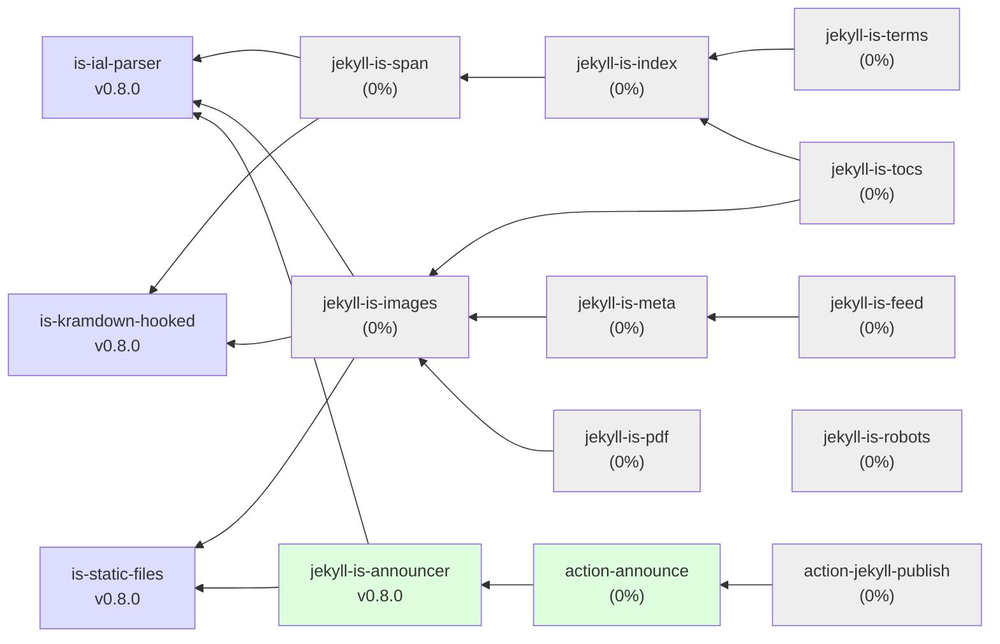

# Jekyll IS

Modular extensions for Jekyll: HTML + LaTeX, without double parsing, through AST manipulations.

## Module Graph

## Gems

### Background utilities (not a plugins)

#### ✔ [is-ial-parser](https://github.com/jekyll-is/is-ial-parser) 
) 

*Universal Inline Attribute List (IAL) parser for Kramdown and Jekyll plugins.*

`is-ial-parser` is a Ruby gem designed to parse Inline Attribute Lists with support for extensions, quoting, interpolation, and type conversion. 
It helps process attribute strings typically embedded in markdown or static site generators like Jekyll, enabling enhanced control over element attributes, 
classes, IDs, and custom extensions.

#### ✔ [is-kramdown-hooked](https://github.com/jekyll-is/is-kramdown-hooked)
)

*Extensible Kramdown parser with inner hooks for enhanced Markdown processing in Jekyll.*

`is-kramdown-hooked` is a flexible Ruby gem that extends the standard Kramdown Markdown parser by adding customizable post-parse hooks. These hooks enable developers 
to inject custom processing steps on the Abstract Syntax Tree (AST) after the default parsing, allowing for advanced Markdown manipulation and seamless integration 
into Jekyll sites or other Ruby projects using Kramdown.

#### ✔ [is-static-files](https://github.com/jekyll-is/is-static-files)
)

*Custom StaticFile descendants for Jekyll.*

`is-static-files` is a Ruby gem that extends Jekyll's static file handling capabilities by providing a custom `StaticFile` class. It allows you to manage static files 
that either come from a source file or from dynamic content held directly in memory. This flexibility enables programmatically generating or modifying static file content 
during the Jekyll build process.

### Announcer

#### ✔ [jekyll-is-announcer](https://github.com/jekyll-is/jekyll-is-announcer)
)

*Announcing new blog posts (to Telegram channel).*

`jekyll-is-announcer` is a Ruby gem for Jekyll that automates announcing new blog posts to external services, currently supporting Telegram channels and IndexNow.

<!-- ☐ ☑ -->
