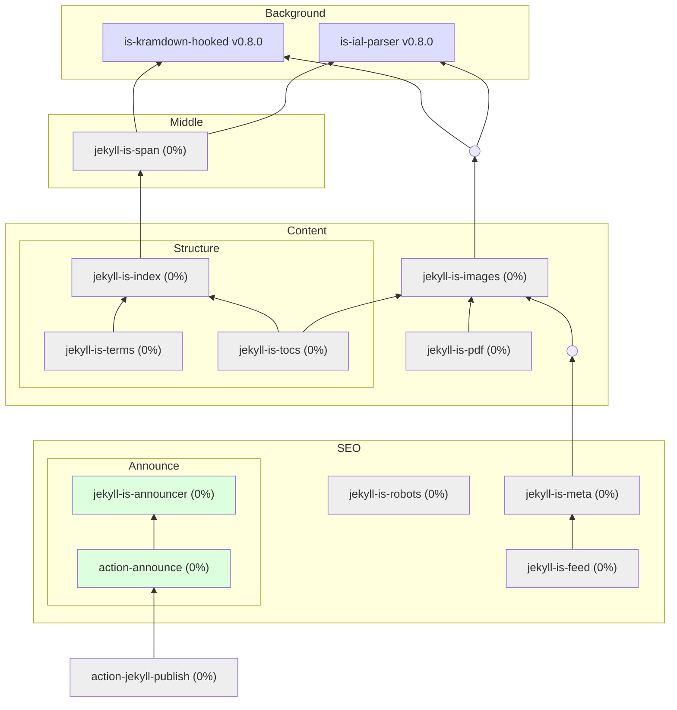

# Jekyll IS

Modular extensions for Jekyll: HTML + LaTeX, without double parsing, through AST manipulations.

## Module Graph

## Gems

### ✔ [is-ial-parser](https://github.com/jekyll-is/is-ial-parser)

Universal Inline Attribute List (IAL) parser for Kramdown and Jekyll plugins.

)

### ✔ [is-kramdown-hooked](https://github.com/jekyll-is/is-kramdown-hooked)

Extensible Kramdown parser with inner hooks for enhanced Markdown processing in Jekyll.

)

### ☑ [jekyll-is-announcer](https://github.com/jekyll-is/jekyll-is-announcer)

Announcing new blog posts (to Telegram channel).

)

<!-- ☐ -->
